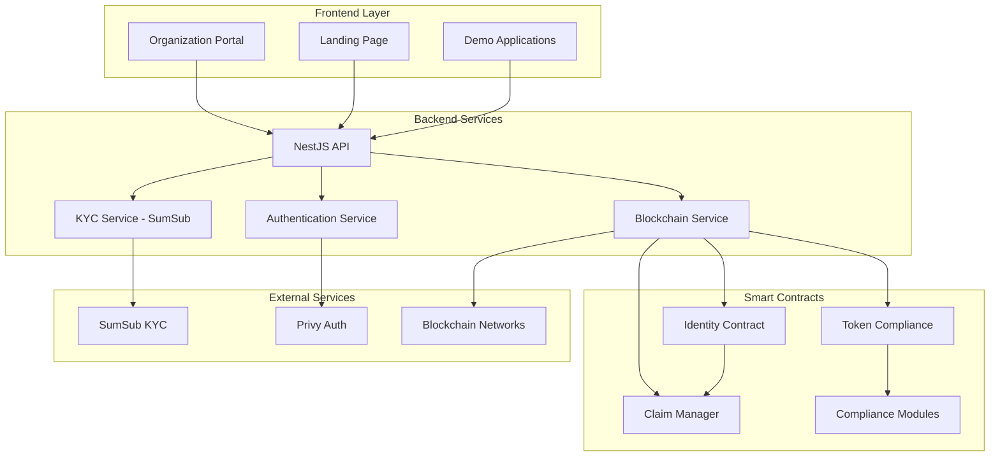
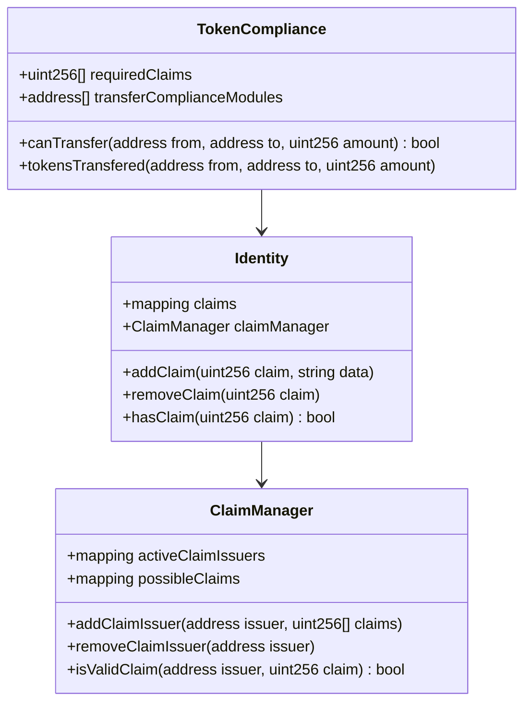

# 🌐 MetaCitizen

**A Decentralized Identity Platform for Compliant DeFi Interactions**

MetaCitizen is an innovative on-chain identity platform that enables decentralized protocols to distinguish between real users while maintaining privacy and compliance. Built to combat money laundering and enable compliant interactions in the DeFi ecosystem, MetaCitizen provides a robust foundation for identity verification without compromising user privacy.

[](https://opensource.org/licenses/MIT)
[](https://getfoundry.sh/)
[](https://nextjs.org/)
[](https://nestjs.com/)

## 🎯 Features

### 🔐 **Decentralized Identity System**
- **Privacy-Preserving Claims**: Users prove specific attributes without exposing their entire identity
- **Attestation Registry**: Decentralized system for managing identity claims and verifications
- **ZK-Proof Support**: Zero-knowledge proof verification for enhanced privacy

### 🏛️ **Compliance-Focused Architecture**
- **Custom Compliance Rules**: Protocols can define their own compliance requirements
- **Modular Compliance System**: Pluggable compliance modules for different use cases
- **Real-time Verification**: Instant verification of user compliance status

### 🔗 **DeFi Integration**
- **Token Compliance**: Built-in compliance checking for token transfers
- **Protocol Interoperability**: Easy integration with existing DeFi protocols
- **Transfer Restrictions**: Configurable rules for compliant asset transfers

### 🌍 **Multi-Regional Support**
- **Jurisdiction-Specific Rules**: Support for different regulatory requirements
- **Geo-compliance**: Location-based compliance verification
- **KYC Integration**: Seamless integration with KYC providers like SumSub

## 🏗️ Architecture



## 🔧 Core Components

### Smart Contracts

#### Identity Contract
The core identity contract that manages user claims and attestations.



#### Claim Types
MetaCitizen supports various types of claims for different compliance requirements:

- **Identity Verification**: Basic KYC completion status
- **Residency Proof**: Geographic location verification
- **Accredited Investor**: Investment qualification status
- **Sanctions Check**: Anti-money laundering compliance
- **Custom Claims**: Protocol-specific requirements

### Backend Architecture

The backend is built with NestJS and provides:

- **User Management**: User registration and profile management
- **KYC Integration**: SumSub integration for identity verification
- **Blockchain Interaction**: Smart contract integration and event monitoring
- **API Gateway**: RESTful APIs for frontend applications

### Frontend Applications

#### Organization Portal
A comprehensive dashboard for organizations to:
- Manage compliance requirements
- Monitor user verification status
- Configure claim requirements
- Generate API keys for protocol integration

#### Landing Page
Marketing website showcasing MetaCitizen's features and capabilities.

#### Demo Applications
Example implementations showing how to integrate MetaCitizen with DeFi protocols.

## 🚀 Quick Start

### Prerequisites

- Node.js (v18 or later)
- pnpm
- PostgreSQL
- Foundry (for smart contracts)

### 1. Clone the Repository

```bash
git clone https://github.com/your-org/metacitizen.git
cd metacitizen
```

### 2. Smart Contracts Setup

```bash
cd contracts
forge install
forge build
forge test
```

Deploy contracts:
```bash
forge script script/Deploy.s.sol --rpc-url <your_rpc_url> --private-key <your_private_key>
```

### 3. Backend Setup

```bash
cd backend
pnpm install

# Set up environment variables
cp .env.example .env
# Edit .env with your configuration

# Start PostgreSQL database
docker-compose up -d

# Run the backend
pnpm start:dev
```

### 4. Frontend Setup

```bash
cd frontend
pnpm install

# Set up environment variables
cp .env.example .env.local
# Edit .env.local with your configuration

# Start the development server
pnpm dev
```

### 5. Landing Page Setup

```bash
cd landing
pnpm install
pnpm dev
```

## 🔧 Configuration

### Environment Variables

#### Backend (.env)
```env
# Database
DB_HOST=localhost
DB_PORT=5432
DB_USERNAME=metacitizen
DB_PASSWORD=your_password
DB_NAME=metacitizen_db

# SumSub Configuration
SUMSUB_SECRET_KEY=your_sumsub_secret
SUMSUB_APP_TOKEN=your_sumsub_app_token

# JWT Configuration
JWT_SECRET=your_jwt_secret

# Blockchain Configuration
RPC_URL=your_rpc_url
PRIVATE_KEY=your_private_key
```

#### Frontend (.env.local)
```env
NEXT_PUBLIC_API_URL=http://localhost:3001
NEXT_PUBLIC_PRIVY_APP_ID=your_privy_app_id
NEXT_PUBLIC_CONTRACT_ADDRESS=deployed_contract_address
```

## 📡 API Reference

### Authentication Endpoints

#### Get Access Token
```http
GET /auth/token
Authorization: Bearer <jwt_token>
```

### KYC Endpoints

#### Get SumSub Access Token
```http
GET /sumsub/access-token
Authorization: Bearer <jwt_token>
```

#### Get KYC Status
```http
GET /sumsub/kyc-status
Authorization: Bearer <jwt_token>
```

### Blockchain Endpoints

#### Verify Identity
```http
POST /blockchain/verify-identity
Content-Type: application/json
Authorization: Bearer <jwt_token>

{
  "address": "0x...",
  "claimType": 1
}
```

## 🧪 Testing

### Smart Contracts
```bash
cd contracts
forge test -vvv
```

### Backend
```bash
cd backend
pnpm test
pnpm test:e2e
```

### Frontend
```bash
cd frontend
pnpm test
```

## 🔒 Security Considerations

- **Private Key Management**: Never commit private keys to version control
- **Environment Variables**: Use secure environment variable management
- **Access Control**: Implement proper role-based access control
- **Rate Limiting**: Configure appropriate rate limits for API endpoints
- **Data Encryption**: Encrypt sensitive user data at rest and in transit

## 🤝 Integration Guide

### Integrating with Your DeFi Protocol

1. **Deploy Token Compliance Contract**
```solidity
TokenCompliance compliance = new TokenCompliance(
    tokenAddress,
    requiredClaims,
    complianceModules
);
```

2. **Check User Compliance**
```solidity
bool canTransfer = compliance.canTransfer(
    fromIdentity,
    toIdentity,
    amount
);
```

3. **Frontend Integration**
```typescript
import { MetaCitizenSDK } from '@metacitizen/sdk';

const sdk = new MetaCitizenSDK({
  apiUrl: 'https://api.metacitizen.io',
  contractAddress: '0x...'
});

const isCompliant = await sdk.checkCompliance(userAddress, requiredClaims);
```

## 🛣️ Roadmap

- [ ] **Q1 2024**: Multi-chain support (Polygon, Arbitrum)
- [ ] **Q2 2024**: Enhanced privacy features with zk-SNARKs
- [ ] **Q3 2024**: Governance token and DAO implementation
- [ ] **Q4 2024**: Advanced compliance modules and reporting

## 📚 Documentation

For detailed documentation, visit our [Documentation Portal](https://docs.metacitizen.io).

## 🤝 Contributing

We welcome contributions! Please read our [Contributing Guide](CONTRIBUTING.md) for details on our code of conduct and the process for submitting pull requests.

## 📄 License

This project is licensed under the MIT License - see the [LICENSE](LICENSE) file for details.

## 🙏 Acknowledgments

- Built with [Foundry](https://getfoundry.sh/) for smart contract development
- Powered by [Next.js](https://nextjs.org/) for the frontend
- Backend built with [NestJS](https://nestjs.com/)
- KYC integration with [SumSub](https://sumsub.com/)
- Authentication powered by [Privy](https://privy.io/)

## 📞 Support

- 📧 Email: support@metacitizen.io
- 💬 Discord: [Join our community](https://discord.gg/metacitizen)
- 🐦 Twitter: [@MetaCitizenIO](https://twitter.com/MetaCitizenIO)

---

**Built with ❤️ by the MetaCitizen Team**
